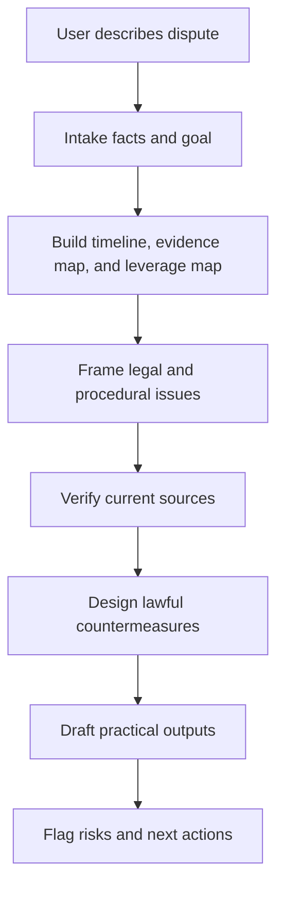

# Rights Defense Legal Strategy

> A Codex skill for mainland China-focused rights-defense strategy, source verification, evidence organization, and lawful countermeasures.

`rights-defense-legal-strategy` turns Codex into a practical legal-operations strategist for ordinary users, founders, small companies, creators, employees, consumers, tenants, merchants, and others facing disputes or institutional pressure in mainland China contexts.

It is built for people who need more than generic legal disclaimers: fact modeling, evidence preservation, current-source verification, pressure-path design, and usable response drafts.

## What It Does

- Models the dispute from the user's position: parties, timeline, goals, stakes, evidence, deadlines, and leverage.
- Requires current legal or procedural verification before concrete legal conclusions.
- Separates confirmed rules, uncertain points, local variations, and strategic risk.
- Produces practical outputs: next actions, evidence checklists, authority tables, negotiation scripts, complaint text, demand letters, response letters, settlement terms, and escalation plans.
- Supports a "team mode" for complex matters, where subagents can separately research law, cases, procedures, and strategy risks before the main agent reconciles the result.

## Why This Exists

Most ordinary people cannot easily access a full legal or compliance team when they face platforms, employers, landlords, large companies, corporate legal departments, debt collectors, or official procedures.

This skill is designed to help Codex act like a disciplined legal-operations partner:

- serious about facts
- serious about evidence
- serious about current sources
- serious about lawful pressure
- serious about the user's practical interests

It does **not** pretend to be a licensed lawyer or official legal opinion provider.

## Core Workflow



## Source Verification Gate

The skill requires Codex to verify current sources before giving specific legal judgments, complaint routes, arbitration/litigation strategy, statutory deadlines, or rights conclusions.

Typical verification fields:

| Field | Purpose |
| --- | --- |
| Source | Law, regulation, judicial interpretation, procedure, platform rule, or official guidance |
| Date | Effective date, amendment date, or publication date |
| Scope | Region, parties, subject matter, thresholds, and exceptions |
| Application | Why it applies or does not apply to the user's facts |
| Uncertainty | Local variation, missing facts, dispute, or unresolved risk |
| Impact | How it changes the strategy |

## Team Mode

For complex matters, the main agent can coordinate subagents like a lightweight legal team:

| Role | Responsibility |
| --- | --- |
| Law Researcher | Verify current law, regulations, judicial interpretations, procedures, and platform rules |
| Case and Pattern Researcher | Find similar cases, regulator actions, public disputes, or platform precedents |
| Procedure and Channel Researcher | Identify filing channels, materials, deadlines, and rejection risks |
| Strategy Reviewer | Stress-test legality, cost, evidence risk, escalation risk, and alternatives |

The main agent remains responsible for final synthesis. Subagents provide research and stress tests, not final advice.

## Installation

Clone or copy this folder into your Codex skills directory:

```bash
mkdir -p ~/.codex/skills
git clone https://github.com/l3onhardt/rights-defense-legal-strategy.git ~/.codex/skills/rights-defense-legal-strategy
```

Then invoke it explicitly:

```text
$rights-defense-legal-strategy 帮我分析这个纠纷，先核验证据和法律依据，再给我合法反击方案。
```

Or use it implicitly when asking Codex about mainland China rights defense, legal strategy, complaint planning, lawyer-letter responses, arbitration/litigation preparation, evidence preservation, or lawful escalation.

## Example Prompts

```text
$rights-defense-legal-strategy 我收到公司律师函，说我侵权，要我三天内赔钱。帮我拆解风险、核验法律依据、设计回复策略。
```

```text
$rights-defense-legal-strategy 平台无理由封了我的账号并扣了余额。请先帮我整理证据，再查平台规则和监管投诉路径。
```

```text
$rights-defense-legal-strategy 房东不退押金，还威胁我。帮我做时间线、证据清单、沟通话术和下一步投诉/起诉准备。
```

```text
$rights-defense-legal-strategy 这是一个复杂劳动争议，请启用团队模式：一个代理查现行劳动法规和仲裁规则，一个代理找类似案例，一个代理审查反击方案。
```

## Repository Layout

```text
rights-defense-legal-strategy/
├── SKILL.md
├── README.md
├── LICENSE
├── agents/
│   └── openai.yaml
└── references/
    ├── research-sources.md
    ├── tactical-patterns.md
    └── team-mode.md
```

## Important Boundaries

This skill is for rights-defense strategy and legal operations support. It does not replace licensed legal representation.

It will not help fabricate evidence, threaten illegally, extort, evade enforcement, bribe, harass, dox, forge documents, conceal assets, or abuse legal procedure.

For high-risk situations involving criminal accusations, detention, major assets, administrative penalties, irreversible settlements, court/arbitration deadlines, personal safety, minors, serious injuries, or government investigations, use this skill to prepare facts and questions, but seek qualified offline help promptly.

## License

MIT License. See [LICENSE](LICENSE).
