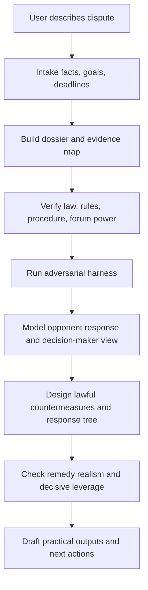

# Rights Defense Legal Strategy

> A skill for mainland China-focused lawful rights-defense strategy, source verification, evidence organization, adversarial modeling, remedy realism, and practical countermeasures.

`rights-defense-legal-strategy` turns ChatGPT/Codex into a practical legal-operations strategist for ordinary users, founders, small companies, creators, employees, consumers, tenants, merchants, and others facing disputes or institutional pressure in mainland China contexts.

It is built for people who need more than generic legal disclaimers or one-sided encouragement: fact modeling, evidence preservation, current-source verification, opponent-response simulation, decision-maker/forum modeling, pressure-path design, settlement design, and usable response drafts.

## What It Does

- Models the dispute from the user's lawful interests while stress-testing the user's position against the opponent's strongest response.
- Requires current legal or procedural verification before concrete legal conclusions.
- Separates confirmed rules, uncertain points, local variations, strategic inference, and risk.
- Uses an adversarial harness: claim/route/proof matrix, counterparty model, decision-maker model, response tree, failure-mode review, and “杀死比赛”/decisive-leverage test.
- Produces practical outputs: next actions, evidence checklists, authority tables, negotiation scripts, complaint text, demand letters, response letters, settlement terms, and arbitration/litigation preparation checklists.
- Supports team mode for complex matters, including law research, procedure research, opposing-counsel modeling, decision-maker modeling, evidence skepticism, settlement design, and strategy review.

## Why This Exists

Most ordinary people cannot easily access a full legal, compliance, evidence, negotiation, and strategy team when they face platforms, employers, landlords, large companies, corporate legal departments, debt collectors, or official procedures.

This skill is designed to help ChatGPT act like a disciplined legal-operations partner:

- serious about facts
- serious about evidence
- serious about current sources
- serious about lawful pressure
- serious about the opponent's strongest case
- serious about the decision-maker's actual power
- serious about the user's practical interests

It does **not** pretend to be a licensed lawyer or official legal opinion provider.

## Core Workflow



## Adversarial Harness

For meaningful disputes, the skill should not output a final strategy until it has answered:

| Question | Purpose |
| --- | --- |
| What must the user prove? | Prevents vague “维权” from replacing a case theory |
| What can the user prove now? | Separates anger and narrative from usable evidence |
| What will the opponent say? | Predicts denial, delay, counterclaims, and procedural defenses |
| What will the decision-maker care about? | Aligns action with court, regulator, platform, arbitration, mediation, or police reality |
| What happens on the second move? | Avoids plans that die when the opponent ignores or denies |
| Is there decisive leverage? | Identifies whether there is a real “杀死比赛” point or only emotional escalation |

## Team Mode

For complex matters, the main agent can coordinate subagents like a lightweight legal operations team:

| Role | Responsibility |
| --- | --- |
| Law Researcher | Verify current law, regulations, judicial interpretations, procedures, and platform rules |
| Procedure and Channel Researcher | Identify filing channels, materials, deadlines, scope, power level, and rejection risks |
| Case and Pattern Researcher | Find similar cases, regulator actions, public disputes, or platform precedents |
| Opposing Counsel / Counterparty Modeler | Build the opponent's strongest factual, legal, procedural, and negotiation response |
| Decision-Maker Modeler | Model how a court, arbitrator, regulator, platform reviewer, mediator, police officer, or administrative body will evaluate the matter |
| Evidence Skeptic | Attack the user's proof record and identify cheap proof improvements |
| Settlement Designer | Build settlement terms that protect the user while giving the opponent a rational exit |
| Strategy Reviewer | Stress-test legality, evidence risk, retaliation, cost, escalation, and remedy realism |

The main agent remains responsible for final synthesis. Subagents provide research and stress tests, not final advice.

## Installation

Clone or copy this folder into your skills directory:

```bash
mkdir -p ~/.codex/skills
git clone https://github.com/l3onhardt/rights-defense-legal-strategy.git ~/.codex/skills/rights-defense-legal-strategy
```

Then invoke it explicitly:

```text
$rights-defense-legal-strategy 帮我分析这个纠纷。不要只站在我这边安慰我；先做对抗建模，找对方最强回应、第三方视角、证据缺口和真正的胜负手。
```

Or use it implicitly when asking about mainland China rights defense, legal strategy, complaint planning, lawyer-letter responses, arbitration/litigation preparation, evidence preservation, lawful escalation, settlement design, or adversarial dispute modeling.

## Example Prompts

```text
$rights-defense-legal-strategy 我收到公司律师函，说我侵权，要我三天内赔钱。帮我拆解风险、核验法律依据、模拟对方律师最强说法，再设计回复策略。
```

```text
$rights-defense-legal-strategy 平台无理由封了我的账号并扣了余额。请先整理证据，再查平台规则和监管投诉路径，同时模拟平台会如何抗辩。
```

```text
$rights-defense-legal-strategy 房东不退押金，还威胁我。不要只给维权话术：帮我做证据矩阵、房东最强抗辩、法院/调解视角、行动树和可谈的底线。
```

```text
$rights-defense-legal-strategy 这是一个复杂劳动争议，请启用团队模式：一个代理查现行劳动法规和仲裁规则，一个代理扮演公司法务反驳我，一个代理做证据怀疑者，一个代理审查最终方案。
```

## Repository Layout

```text
rights-defense-legal-strategy/
├── SKILL.md
├── README.md
├── LICENSE
├── agents/
│   └── openai.yaml
└── references/
    ├── adversarial-harness.md
    ├── remedy-realism.md
    ├── research-sources.md
    ├── tactical-patterns.md
    └── team-mode.md
```

## Important Boundaries

This skill is for rights-defense strategy and legal operations support. It does not replace licensed legal representation.

It will not help fabricate evidence, threaten illegally, extort, evade enforcement, bribe, harass, dox, forge documents, conceal assets, abuse legal procedure, conduct illegal public pressure, or misuse criminal/administrative channels for civil coercion.

For high-risk situations involving criminal accusations, detention, major assets, administrative penalties, irreversible settlements, court/arbitration deadlines, personal safety, minors, serious injuries, or government investigations, use this skill to prepare facts and questions, but seek qualified offline help promptly.

## License

MIT License. See [LICENSE](LICENSE).
